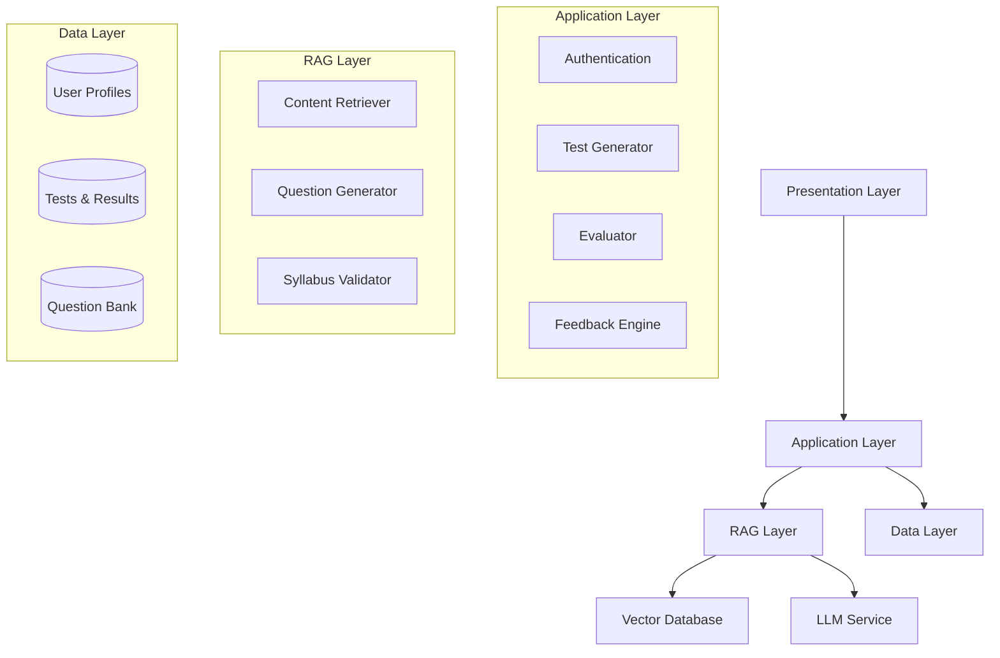

# Design Document: MockPrep

## Overview

MockPrep is an exam preparation platform that uses a RAG (Retrieval-Augmented Generation) + LLM architecture to generate syllabus-aligned mock tests for CBSE and Cambridge students in grades 1-10. The system follows a clear workflow: registration → topic selection → test configuration → test generation → test taking → evaluation → feedback → improvement tracking.

The architecture separates concerns into distinct layers:
- **Presentation Layer**: User interface for web/mobile
- **Application Layer**: Business logic for test generation, evaluation, and feedback
- **RAG Layer**: Syllabus content retrieval and question generation
- **Data Layer**: Persistent storage for user data, tests, and performance history

Key design principles:
1. **Syllabus Fidelity**: All questions must align with official curriculum content
2. **Exam Realism**: Tests should mirror actual exam format and difficulty
3. **Immediate Feedback**: Automated evaluation with actionable insights
4. **Progressive Learning**: Track improvement and identify weak areas
5. **Separation of Concerns**: Clear boundaries between retrieval, generation, and evaluation

## Architecture

### High-Level Architecture



### Component Responsibilities

**Presentation Layer**:
- User registration and authentication UI
- Topic selection interface with syllabus tree
- Test configuration forms
- In-app exam interface with question navigation
- PDF generation and download
- Performance dashboard and history visualization

**Application Layer**:
- **Authentication Service**: User registration, login, profile management
- **Test Generator**: Orchestrates test creation from configuration to question selection
- **Evaluator**: Compares user responses against answer keys, calculates scores
- **Feedback Engine**: Identifies weak topics, generates improvement suggestions
- **History Tracker**: Manages performance history and trend analysis

**RAG Layer**:
- **Content Retriever**: Semantic search over syllabus-indexed question bank
- **Question Generator**: LLM-based question creation with syllabus grounding
- **Syllabus Validator**: Ensures generated questions match curriculum requirements
- **Embedding Service**: Converts syllabus content and questions to vector embeddings

**Data Layer**:
- **User Repository**: CRUD operations for user profiles
- **Test Repository**: Storage and retrieval of test configurations, questions, and results
- **Question Bank Repository**: Manages RAG-indexed question collection
- **Performance Repository**: Historical test results and analytics

## Components and Interfaces

### 1. Authentication Service

**Purpose**: Manage user registration, login, and profile data

**Interface**:
```typescript
interface AuthenticationService {
  registerUser(profile: UserProfile): Result<UserId, RegistrationError>
  login(credentials: Credentials): Result<Session, AuthError>
  getUserProfile(userId: UserId): Result<UserProfile, NotFoundError>
  updateProfile(userId: UserId, updates: ProfileUpdates): Result<void, UpdateError>
}

type UserProfile = {
  userId: UserId
  curriculum: 'CBSE' | 'Cambridge'
  grade: number  // 1-10
  subjects: Subject[]
  createdAt: Timestamp
}

type RegistrationError = 
  | { type: 'InvalidGrade', grade: number }
  | { type: 'InvalidSubject', subject: string }
  | { type: 'DuplicateUser' }
```

**Key Operations**:
- Validate grade is between 1-10
- Validate subjects exist for curriculum and grade
- Persist user profile with timestamps
- Restore profile on login

### 2. Syllabus Service

**Purpose**: Provide curriculum-specific topic hierarchies and validation

**Interface**:
```typescript
interface SyllabusService {
  getTopicsForSubject(curriculum: Curriculum, grade: number, subject: Subject): Topic[]
  validateTopics(curriculum: Curriculum, grade: number, topics: TopicId[]): Result<void, ValidationError>
  getSyllabusContent(topicId: TopicId): SyllabusContent
}

type Topic = {
  topicId: TopicId
  name: string
  parentTopic?: TopicId
  syllabusSection: string
  curriculum: Curriculum
  grade: number
  subject: Subject
}

type SyllabusContent = {
  topicId: TopicId
  officialText: string
  learningObjectives: string[]
  keyTerms: string[]
}
```

**Key Operations**:
- Return hierarchical topic structure for curriculum/grade/subject
- Validate topic IDs belong to specified curriculum and grade
- Provide syllabus content for RAG grounding

### 3. Test Generator

**Purpose**: Orchestrate mock test creation from configuration to question selection

**Interface**:
```typescript
interface TestGenerator {
  generateTests(config: TestConfiguration, userId: UserId): Result<GeneratedTests, GenerationError>
  validateConfiguration(config: TestConfiguration): Result<void, ConfigError>
}

type TestConfiguration = {
  subject: Subject
  topics: TopicId[]
  questionCount: number
  testCount: number
  mode: 'PrintablePDF' | 'InAppExam'
}

type GeneratedTests = {
  tests: MockTest[]
  answerKeys: AnswerKey[]
}

type MockTest = {
  testId: TestId
  userId: UserId
  config: TestConfiguration
  questions: Question[]
  createdAt: Timestamp
}

type Question = {
  questionId: QuestionId
  text: string
  questionType: 'MultipleChoice' | 'ShortAnswer' | 'Numerical'
  options?: string[]  // for multiple choice
  topicId: TopicId
  syllabusReference: string
}

type AnswerKey = {
  testId: TestId
  answers: Map<QuestionId, CorrectAnswer>
}

type GenerationError =
  | { type: 'InsufficientQuestions', available: number, requested: number }
  | { type: 'InvalidConfiguration', reason: string }
```

**Key Operations**:
- Validate configuration (positive integers, topic existence)
- Check question bank has sufficient unique questions
- Call RAG layer to retrieve/generate questions
- Ensure question uniqueness across multiple tests
- Associate answer keys with tests

### 4. RAG Content Retriever

**Purpose**: Retrieve syllabus-aligned questions using semantic search

**Interface**:
```typescript
interface RAGRetriever {
  retrieveQuestions(
    topics: TopicId[], 
    count: number, 
    excludeIds: QuestionId[]
  ): Result<Question[], RetrievalError>
  
  getSyllabusContext(topicId: TopicId): SyllabusContext
  
  indexQuestion(question: Question, embedding: Vector): Result<void, IndexError>
}

type SyllabusContext = {
  topicId: TopicId
  content: string
  relatedConcepts: string[]
  embedding: Vector
}

type RetrievalError =
  | { type: 'InsufficientMatches', found: number, requested: number }
  | { type: 'VectorDBError', message: string }
```

**Key Operations**:
- Perform semantic search over question bank using topic embeddings
- Filter out previously used questions (excludeIds)
- Return questions ranked by syllabus relevance score
- Provide syllabus context for LLM grounding

### 5. Question Generator (LLM-based)

**Purpose**: Generate new questions when question bank is insufficient

**Interface**:
```typescript
interface QuestionGenerator {
  generateQuestions(
    syllabusContext: SyllabusContext,
    count: number,
    existingQuestions: Question[]
  ): Result<Question[], GenerationError>
  
  validateSyllabusAlignment(
    question: Question,
    syllabusContext: SyllabusContext
  ): Result<AlignmentScore, ValidationError>
}

type AlignmentScore = {
  score: number  // 0-1
  reasoning: string
  syllabusReferences: string[]
}
```

**Key Operations**:
- Use LLM with syllabus context to generate questions
- Ensure questions are exam-realistic (no difficulty selection)
- Validate generated questions align with syllabus
- Avoid duplicating existing questions

### 6. Test Execution Service

**Purpose**: Manage in-app test taking and PDF generation

**Interface**:
```typescript
interface TestExecutionService {
  startTest(testId: TestId, userId: UserId): Result<TestSession, StartError>
  submitAnswer(sessionId: SessionId, questionId: QuestionId, answer: UserAnswer): Result<void, SubmitError>
  submitTest(sessionId: SessionId): Result<TestSubmission, SubmitError>
  generatePDF(testId: TestId, includeAnswers: boolean): Result<PDFDocument, PDFError>
}

type TestSession = {
  sessionId: SessionId
  testId: TestId
  userId: UserId
  startedAt: Timestamp
  responses: Map<QuestionId, UserAnswer>
  status: 'InProgress' | 'Submitted'
}

type UserAnswer = {
  questionId: QuestionId
  answer: string
  answeredAt: Timestamp
}

type TestSubmission = {
  sessionId: SessionId
  testId: TestId
  responses: Map<QuestionId, UserAnswer>
  submittedAt: Timestamp
}
```

**Key Operations**:
- Create test session on test start
- Track user responses with timestamps
- Prevent answer modification after submission
- Generate formatted PDF (with or without answers)
- Ensure no hints/answers accessible during test

### 7. Evaluator

**Purpose**: Automatically evaluate submitted tests and calculate scores

**Interface**:
```typescript
interface Evaluator {
  evaluateTest(submission: TestSubmission, answerKey: AnswerKey): EvaluationResult
  compareAnswers(userAnswer: string, correctAnswer: string, questionType: QuestionType): boolean
}

type EvaluationResult = {
  testId: TestId
  userId: UserId
  overallScore: number  // percentage
  topicScores: Map<TopicId, TopicScore>
  correctAnswers: number
  totalQuestions: number
  evaluatedAt: Timestamp
}

type TopicScore = {
  topicId: TopicId
  correct: number
  total: number
  percentage: number
}
```

**Key Operations**:
- Compare user responses against answer key
- Calculate overall score as percentage
- Calculate per-topic scores
- Handle different question types (multiple choice, short answer, numerical)
- Generate evaluation result with timestamp

### 8. Feedback Engine

**Purpose**: Identify weak topics and generate improvement suggestions

**Interface**:
```typescript
interface FeedbackEngine {
  generatePerformanceReport(evaluation: EvaluationResult, test: MockTest): PerformanceReport
  identifyWeakTopics(topicScores: Map<TopicId, TopicScore>, threshold: number): WeakTopic[]
  generateImprovementSuggestions(weakTopics: WeakTopic[]): ImprovementSuggestion[]
}

type PerformanceReport = {
  testId: TestId
  userId: UserId
  evaluation: EvaluationResult
  weakTopics: WeakTopic[]
  suggestions: ImprovementSuggestion[]
  createdAt: Timestamp
}

type WeakTopic = {
  topicId: TopicId
  topicName: string
  score: number
  questionsAttempted: number
  questionsCorrect: number
}

type ImprovementSuggestion = {
  topicId: TopicId
  syllabusSection: string
  conceptsToReview: string[]
  retryTestOption: boolean
}
```

**Key Operations**:
- Identify topics with score < 60% as weak
- Rank topics from weakest to strongest
- Generate targeted suggestions referencing syllabus
- Offer retry test option for weak topics

### 9. Performance History Service

**Purpose**: Track and visualize performance over time

**Interface**:
```typescript
interface PerformanceHistoryService {
  getTestHistory(userId: UserId): TestHistoryEntry[]
  getPerformanceReport(testId: TestId): Result<PerformanceReport, NotFoundError>
  getPerformanceTrends(userId: UserId, subject: Subject): PerformanceTrend[]
}

type TestHistoryEntry = {
  testId: TestId
  testDate: Timestamp
  subject: Subject
  topics: TopicId[]
  overallScore: number
}

type PerformanceTrend = {
  subject: Subject
  topicId?: TopicId
  dataPoints: TrendDataPoint[]
}

type TrendDataPoint = {
  date: Timestamp
  score: number
  testId: TestId
}
```

**Key Operations**:
- Retrieve test history in reverse chronological order
- Fetch complete performance reports for historical tests
- Calculate performance trends per subject and topic
- Provide data for visualization

## Data Models

### User Profile
```typescript
type UserProfile = {
  userId: UserId
  email: string
  passwordHash: string
  curriculum: 'CBSE' | 'Cambridge'
  grade: number  // 1-10
  subjects: Subject[]
  createdAt: Timestamp
  lastLogin: Timestamp
}
```

### Syllabus Topic
```typescript
type SyllabusTopic = {
  topicId: TopicId
  curriculum: 'CBSE' | 'Cambridge'
  grade: number
  subject: Subject
  topicName: string
  parentTopicId?: TopicId
  syllabusSection: string
  officialContent: string
  learningObjectives: string[]
  embedding: Vector
}
```

### Question
```typescript
type Question = {
  questionId: QuestionId
  topicId: TopicId
  questionText: string
  questionType: 'MultipleChoice' | 'ShortAnswer' | 'Numerical'
  options?: string[]
  correctAnswer: string
  syllabusReference: string
  difficulty: 'ExamRealistic'  // no user selection
  embedding: Vector
  createdAt: Timestamp
}
```

### Mock Test
```typescript
type MockTest = {
  testId: TestId
  userId: UserId
  subject: Subject
  topics: TopicId[]
  questions: QuestionId[]
  mode: 'PrintablePDF' | 'InAppExam'
  createdAt: Timestamp
  status: 'Generated' | 'InProgress' | 'Submitted'
}
```

### Test Session
```typescript
type TestSession = {
  sessionId: SessionId
  testId: TestId
  userId: UserId
  startedAt: Timestamp
  submittedAt?: Timestamp
  responses: UserResponse[]
  status: 'InProgress' | 'Submitted'
}

type UserResponse = {
  questionId: QuestionId
  userAnswer: string
  answeredAt: Timestamp
}
```

### Evaluation Result
```typescript
type EvaluationResult = {
  evaluationId: EvaluationId
  testId: TestId
  userId: UserId
  overallScore: number
  correctCount: number
  totalCount: number
  topicScores: TopicScore[]
  evaluatedAt: Timestamp
}

type TopicScore = {
  topicId: TopicId
  topicName: string
  correct: number
  total: number
  percentage: number
}
```

### Performance Report
```typescript
type PerformanceReport = {
  reportId: ReportId
  testId: TestId
  userId: UserId
  evaluationId: EvaluationId
  weakTopics: WeakTopic[]
  improvementSuggestions: ImprovementSuggestion[]
  createdAt: Timestamp
}

type WeakTopic = {
  topicId: TopicId
  topicName: string
  score: number
  questionsAttempted: number
  questionsCorrect: number
}

type ImprovementSuggestion = {
  topicId: TopicId
  syllabusSection: string
  conceptsToReview: string[]
  retryTestOption: boolean
}
```

### Database Schema Considerations

**User Profiles Table**:
- Primary key: userId
- Indexes: email (unique), curriculum + grade + subject (for topic filtering)

**Syllabus Topics Table**:
- Primary key: topicId
- Indexes: curriculum + grade + subject, parentTopicId
- Vector index: embedding (for semantic search)

**Questions Table**:
- Primary key: questionId
- Indexes: topicId, curriculum + grade + subject
- Vector index: embedding (for RAG retrieval)

**Tests Table**:
- Primary key: testId
- Indexes: userId + createdAt (for history), status

**Test Sessions Table**:
- Primary key: sessionId
- Indexes: testId, userId, status

**Evaluations Table**:
- Primary key: evaluationId
- Indexes: testId (unique), userId + evaluatedAt

**Performance Reports Table**:
- Primary key: reportId
- Indexes: testId (unique), userId + createdAt

## Correctness Properties

*A property is a characteristic or behavior that should hold true across all valid executions of a system—essentially, a formal statement about what the system should do. Properties serve as the bridge between human-readable specifications and machine-verifiable correctness guarantees.*

### Property Reflection

After analyzing all acceptance criteria, I've identified the following redundancies to eliminate:

- **1.5 is redundant with 1.4**: Both test profile persistence round-tripping
- **3.3 is redundant with 3.2**: Both test positive integer validation (can combine into one property)
- **10.4 is redundant with 10.2**: Both test syllabus references in suggestions
- **14.1 is redundant with 4.4**: Both test question uniqueness across tests
- **15.3 and 15.5 are redundant with 6.4**: All test preventing answer key access during active tests

The remaining properties provide unique validation value and will be formalized below.

### Properties

**Property 1: Registration captures all required fields**
*For any* valid registration request, the stored user profile should contain curriculum, grade (1-10), and at least one subject.
**Validates: Requirements 1.1**

**Property 2: Grade validation accepts only valid range**
*For any* integer value, the system should accept it as a grade if and only if it is between 1 and 10 inclusive.
**Validates: Requirements 1.2**

**Property 3: Subject filtering by curriculum and grade**
*For any* curriculum and grade combination, all returned subjects should belong to that specific curriculum and grade.
**Validates: Requirements 1.3**

**Property 4: User profile persistence round-trip**
*For any* valid user profile, saving then retrieving the profile should produce an equivalent profile with all fields preserved.
**Validates: Requirements 1.4, 1.5**

**Property 5: Topic filtering by user context**
*For any* user profile (curriculum, grade, subject), all returned topics should match the user's curriculum, grade, and selected subject.
**Validates: Requirements 2.1**

**Property 6: Non-empty topic selection**
*For any* non-empty list of valid topics, the system should accept it as a valid topic selection.
**Validates: Requirements 2.3**

**Property 7: Topic validation against syllabus**
*For any* topic selection and user context, the system should accept the selection if and only if all topics exist in the syllabus for the user's curriculum and grade.
**Validates: Requirements 2.4**

**Property 8: Test configuration captures all fields**
*For any* valid test configuration, the stored configuration should contain subject, topics, question count, and test count.
**Validates: Requirements 3.1**

**Property 9: Positive integer validation**
*For any* numeric value, the system should accept it as a question count or test count if and only if it is a positive integer.
**Validates: Requirements 3.2, 3.3**

**Property 10: Question availability validation**
*For any* test configuration and question bank state, the system should reject the configuration if the requested number of unique questions exceeds the available questions for the selected topics.
**Validates: Requirements 3.4**

**Property 11: Test configuration persistence round-trip**
*For any* valid test configuration, saving then retrieving the configuration should produce an equivalent configuration with all fields preserved.
**Validates: Requirements 3.5**

**Property 12: Generated questions match selected topics**
*For any* test generation request with selected topics, all generated questions should have topicIds that are in the set of selected topics.
**Validates: Requirements 4.2**

**Property 13: Question uniqueness across multiple tests**
*For any* set of multiple tests generated from the same configuration, no question should appear in more than one test.
**Validates: Requirements 4.4, 14.1**

**Property 14: Answer key completeness**
*For any* generated test, the answer key should contain exactly one correct answer for each question in the test.
**Validates: Requirements 4.5**

**Property 15: PDF contains all test questions**
*For any* test, the generated PDF should contain all questions from the test.
**Validates: Requirements 5.1**

**Property 16: Test PDF excludes answers**
*For any* test PDF, it should not contain any answer key information or correct answers.
**Validates: Requirements 5.3**

**Property 17: Separate answer key PDF exists**
*For any* test, both a test PDF and a separate answer key PDF should be generated, and they should contain different content.
**Validates: Requirements 5.5**

**Property 18: Answer key access control during active test**
*For any* active test session (not yet submitted), attempts to access the answer key should be denied.
**Validates: Requirements 6.4, 15.3, 15.5**

**Property 19: Test response persistence**
*For any* test session, all submitted responses should be saved and retrievable.
**Validates: Requirements 6.5**

**Property 20: Response timestamps**
*For any* submitted test, all user responses should have timestamps indicating when they were answered.
**Validates: Requirements 7.1**

**Property 21: Answer key access after submission**
*For any* submitted test, the answer key should become accessible to the user.
**Validates: Requirements 7.2**

**Property 22: Response immutability after submission**
*For any* submitted test, attempts to modify responses should be rejected.
**Validates: Requirements 7.4**

**Property 23: Score calculation accuracy**
*For any* test submission with known correct/incorrect answers, the calculated percentage should equal (correct answers / total questions) × 100.
**Validates: Requirements 8.2**

**Property 24: Per-topic score calculation**
*For any* test with multiple topics, each topic should have a score calculated based on the questions belonging to that topic.
**Validates: Requirements 8.3**

**Property 25: Weak topic identification threshold**
*For any* test evaluation, topics with accuracy below 60% should be identified as weak topics, and topics with accuracy ≥ 60% should not be identified as weak.
**Validates: Requirements 8.4**

**Property 26: Performance report generation**
*For any* completed test evaluation, a performance report should be generated and stored.
**Validates: Requirements 8.5**

**Property 27: Performance report completeness**
*For any* performance report, it should contain overall score, per-topic scores, and identified weak topics.
**Validates: Requirements 9.1**

**Property 28: Topic ranking by performance**
*For any* performance report with multiple topics, topics should be ranked from lowest to highest score.
**Validates: Requirements 9.2**

**Property 29: Weak topic data completeness**
*For any* weak topic in a performance report, it should include the number of questions attempted and the percentage correct.
**Validates: Requirements 9.3**

**Property 30: Report access control timing**
*For any* test that has not been submitted, the performance report should not be accessible.
**Validates: Requirements 9.4**

**Property 31: Performance report persistence round-trip**
*For any* performance report, saving then retrieving the report should produce an equivalent report with all fields preserved.
**Validates: Requirements 9.5**

**Property 32: Improvement suggestions for all weak topics**
*For any* set of identified weak topics, improvement suggestions should be generated for each weak topic.
**Validates: Requirements 10.1**

**Property 33: Suggestions contain syllabus references**
*For any* improvement suggestion, it should reference specific syllabus sections or concepts to review.
**Validates: Requirements 10.2, 10.4**

**Property 34: Retry test option availability**
*For any* set of weak topics, the system should offer the option to generate a retry test focused on those topics.
**Validates: Requirements 10.3**

**Property 35: Retry test topic flexibility**
*For any* retry test request, the system should accept topic configurations that include the same topics, different topics, or a combination.
**Validates: Requirements 10.5**

**Property 36: Test and report storage**
*For any* completed test, both the test and its performance report should be stored and retrievable.
**Validates: Requirements 11.1**

**Property 37: History chronological ordering**
*For any* user's test history, tests should be returned in reverse chronological order (most recent first).
**Validates: Requirements 11.2**

**Property 38: History entry completeness**
*For any* test in the history, the history entry should contain test date, subject, topics covered, and overall score.
**Validates: Requirements 11.3**

**Property 39: Historical report completeness**
*For any* historical test, retrieving its performance report should return the complete original report including all questions and answers.
**Validates: Requirements 11.4**

**Property 40: Data persistence across sessions**
*For any* user data (profiles, configurations, tests, reports), logging out then logging back in should restore all data unchanged.
**Validates: Requirements 12.1, 12.2**

**Property 41: Event timestamps**
*For any* stored test data, all significant events (creation, submission, evaluation) should have timestamps.
**Validates: Requirements 12.4**

**Property 42: Concurrent access safety**
*For any* sequence of concurrent operations on user data, the final state should be consistent and no data should be corrupted.
**Validates: Requirements 12.5**

**Property 43: Question bank syllabus references**
*For any* question in the question bank, it should reference a specific syllabus section.
**Validates: Requirements 13.3**

**Property 44: Question prioritization by relevance**
*For any* question retrieval request, questions with higher syllabus relevance scores should be selected before questions with lower scores.
**Validates: Requirements 13.5**

**Property 45: Insufficient questions error handling**
*For any* test configuration where unique questions are insufficient, the system should return an error indicating the shortfall and suggesting adjustments.
**Validates: Requirements 14.2**

**Property 46: Question tracking per user**
*For any* user, the system should track which questions have been presented to that user across all tests.
**Validates: Requirements 14.3**

**Property 47: Retry test prioritizes unseen questions**
*For any* retry test request, questions the user has not seen before should be selected before questions the user has already seen.
**Validates: Requirements 14.4**

**Property 48: No assistance during active test**
*For any* active test session, requests for hints, explanations, or answer suggestions should be denied.
**Validates: Requirements 15.1**

## Error Handling

### Error Categories

**Validation Errors**:
- Invalid grade (not 1-10)
- Invalid subject for curriculum/grade
- Invalid topic for curriculum/grade/subject
- Non-positive question count or test count
- Empty topic selection
- Invalid question type

**Resource Errors**:
- Insufficient questions in question bank
- User not found
- Test not found
- Session not found
- Performance report not found

**State Errors**:
- Attempting to modify submitted test
- Accessing answer key during active test
- Accessing performance report before submission
- Submitting already-submitted test

**System Errors**:
- RAG retrieval failure
- LLM generation failure
- PDF generation failure
- Database connection failure
- Vector database failure

### Error Handling Strategy

**Validation Errors**:
- Return immediately with descriptive error message
- Include specific validation failure reason
- Suggest corrective action (e.g., "Grade must be between 1 and 10")
- Do not persist invalid data

**Resource Errors**:
- Return error with resource identifier
- For insufficient questions: include available count and requested count
- Suggest alternatives (e.g., reduce question count, select more topics)
- Log error for monitoring

**State Errors**:
- Return error with current state information
- Explain why operation is not allowed in current state
- Suggest correct workflow (e.g., "Submit test before accessing answer key")
- Do not modify state

**System Errors**:
- Log detailed error information for debugging
- Return user-friendly error message
- Implement retry logic for transient failures
- Provide fallback behavior where possible (e.g., use cached questions if RAG fails)
- Alert monitoring systems for critical failures

### Error Response Format

```typescript
type ErrorResponse = {
  errorType: 'Validation' | 'Resource' | 'State' | 'System'
  errorCode: string
  message: string
  details?: Record<string, any>
  suggestedAction?: string
  timestamp: Timestamp
}
```

### Retry and Recovery

**Transient Failures**:
- Implement exponential backoff for RAG/LLM calls
- Maximum 3 retry attempts
- Cache successful responses to reduce API calls

**Partial Failures**:
- If some questions fail to generate, use question bank fallback
- If PDF generation fails, offer in-app viewing as alternative
- If performance report generation fails, allow manual retry

**Data Integrity**:
- Use database transactions for multi-step operations
- Implement idempotency for test submission
- Validate data consistency before and after operations

## Testing Strategy

### Dual Testing Approach

The testing strategy combines unit tests and property-based tests to ensure comprehensive coverage:

- **Unit tests**: Verify specific examples, edge cases, and error conditions
- **Property-based tests**: Verify universal properties across all inputs
- Both approaches are complementary and necessary for complete validation

### Unit Testing

**Focus Areas**:
- Specific examples demonstrating correct behavior
- Edge cases (empty inputs, boundary values, special characters)
- Error conditions and error message accuracy
- Integration points between components
- PDF formatting and content
- Database transaction handling

**Example Unit Tests**:
- User registration with valid CBSE grade 5 profile
- Test generation with exactly 1 question
- Score calculation with 0% and 100% scores
- Weak topic identification at exactly 60% threshold
- Answer key access denial during active test
- Historical test retrieval for user with no tests

**Unit Test Balance**:
- Avoid writing too many unit tests for scenarios covered by properties
- Focus unit tests on concrete examples and integration scenarios
- Use unit tests to validate error messages and user-facing content

### Property-Based Testing

**Library Selection**:
- **TypeScript/JavaScript**: fast-check
- **Python**: Hypothesis
- **Java**: jqwik
- **Go**: gopter

**Configuration**:
- Minimum 100 iterations per property test
- Each test tagged with feature name and property number
- Tag format: `Feature: mockprep, Property {N}: {property text}`

**Property Test Coverage**:

Each of the 48 correctness properties listed above must be implemented as a property-based test. Key property tests include:

1. **Data Validation Properties** (Properties 2, 6, 7, 9, 10):
   - Generate random inputs and verify validation logic
   - Test boundary conditions automatically

2. **Persistence Properties** (Properties 4, 11, 19, 31, 36, 40):
   - Generate random data structures
   - Verify round-trip consistency (save → retrieve → compare)

3. **Filtering Properties** (Properties 3, 5, 12):
   - Generate random datasets and filter criteria
   - Verify all results match filter conditions

4. **Calculation Properties** (Properties 23, 24, 25):
   - Generate random test results
   - Verify mathematical correctness of scores and percentages

5. **Uniqueness Properties** (Property 13):
   - Generate multiple tests
   - Verify no question duplication across tests

6. **Access Control Properties** (Properties 18, 21, 22, 30):
   - Generate random test states
   - Verify access rules enforced correctly

7. **Ordering Properties** (Properties 28, 37):
   - Generate random collections
   - Verify correct sorting behavior

8. **Completeness Properties** (Properties 1, 8, 14, 27, 29, 38):
   - Generate random entities
   - Verify all required fields present

**Generator Design**:
- Create generators for all domain types (UserProfile, TestConfiguration, Question, etc.)
- Ensure generators produce valid data by default
- Create separate generators for invalid data to test error handling
- Use shrinking to find minimal failing examples

**Example Property Test Structure**:
```typescript
// Feature: mockprep, Property 4: User profile persistence round-trip
test('user profile round-trip preserves all fields', async () => {
  await fc.assert(
    fc.asyncProperty(
      userProfileGenerator(),
      async (profile) => {
        const userId = await authService.registerUser(profile);
        const retrieved = await authService.getUserProfile(userId);
        
        expect(retrieved.curriculum).toBe(profile.curriculum);
        expect(retrieved.grade).toBe(profile.grade);
        expect(retrieved.subjects).toEqual(profile.subjects);
      }
    ),
    { numRuns: 100 }
  );
});
```

### Integration Testing

**Test Scenarios**:
- Complete user workflow: registration → test generation → test taking → evaluation → feedback
- Multi-test generation with uniqueness verification
- Concurrent user access to shared resources
- RAG retrieval → LLM generation → validation pipeline
- PDF generation for various test configurations

**Integration Test Focus**:
- Component interaction and data flow
- End-to-end workflows
- External service integration (LLM, vector database)
- Performance under realistic load

### Test Data Management

**Syllabus Test Data**:
- Maintain sample syllabus data for CBSE and Cambridge
- Include multiple grades and subjects
- Ensure sufficient topic coverage for test generation

**Question Bank Test Data**:
- Seed test database with diverse questions
- Cover all question types and topics
- Include edge cases (very long questions, special characters)

**User Test Data**:
- Generate test users for different curricula and grades
- Include users with extensive test history
- Test with users having no history

### Performance Testing

**Load Testing**:
- Concurrent test generation requests
- Concurrent test submissions and evaluations
- Large question bank retrieval operations
- Historical data retrieval for users with many tests

**Performance Targets**:
- Test generation: < 5 seconds for 50 questions
- Test evaluation: < 1 second for 50 questions
- PDF generation: < 3 seconds for 50 questions
- History retrieval: < 500ms for 100 tests

### Continuous Testing

**Pre-commit**:
- Run unit tests
- Run fast property tests (10 iterations)

**CI Pipeline**:
- Run all unit tests
- Run full property tests (100 iterations)
- Run integration tests
- Generate coverage report (target: 80% coverage)

**Nightly**:
- Run extended property tests (1000 iterations)
- Run performance tests
- Run concurrency stress tests